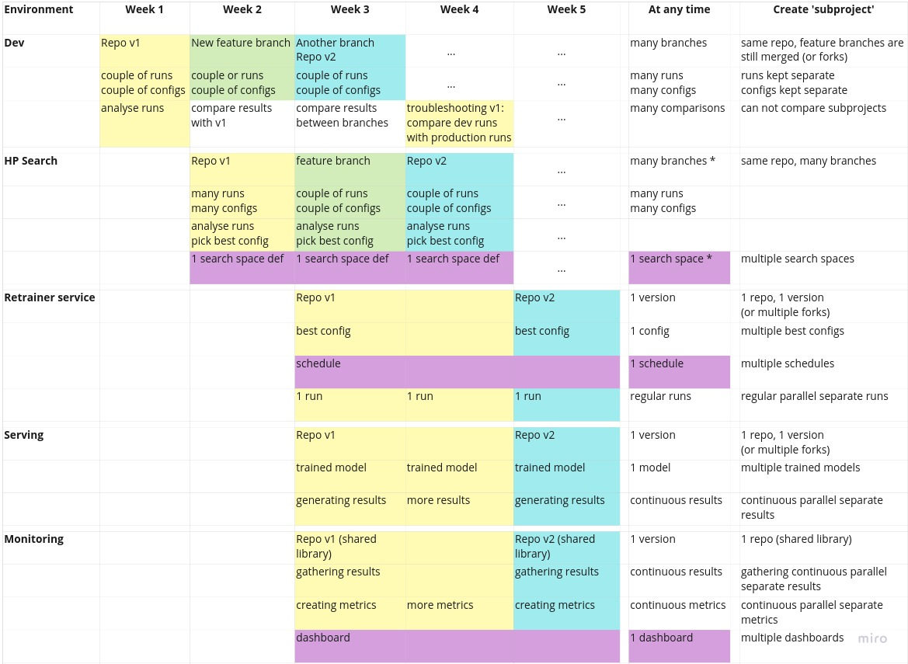
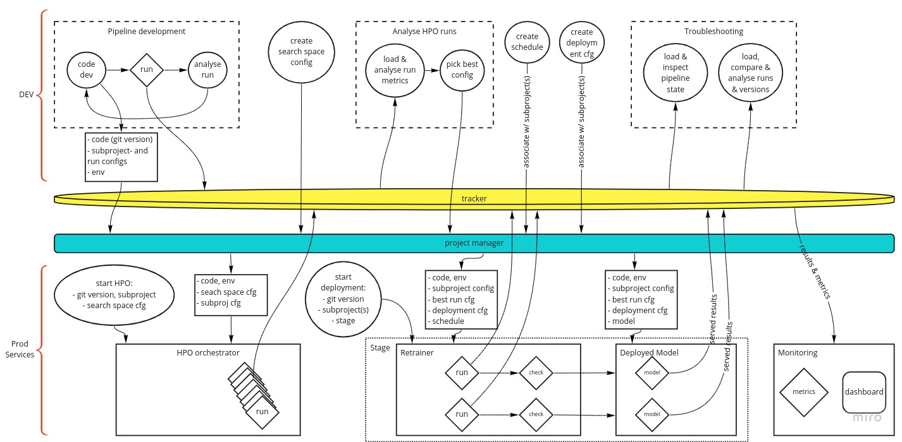

# Getting my MLOps Thoughts Straight

MLOps has a lot of moving parts, I’m trying to make sure I’ve given them all a spot in my ideas. 

I’ve written one blogpost about MLOps previously, which was like an introduction to the subject I guess. Both for me and for the reader. I talked about some ideas for making the data scientist’s work more efficient, more reliable and more enjoyable.

But there are so many moving parts to developing and productionalizing machine learning, that I wanted to set down all my ideas as clearly and concretely as possible, in maximum detail stopping just short of actually going into the technology. 

I’m basing the ideas in this post upon my thoughts and frustrations build up over let’s say 8 years of working with data and code. On purpose I’m trying to not let myself be influenced too much (yet!) by the big players’ technology and platforms. I feel that this is the best way to judge later where there are gaps in my understanding or assessment and where there are gaps in the technology that’s on offer. 

So what you will find below is a bit like a problem definition, and it’s an exercise as much for my own sake as for anyone else’s. I will try to define as exactly as possible all the tasks that a data scientist does that are related to model development and maintenance, and which will need to be covered by our MLOps method (tech platform plus way of working).

Ideally, this definition should be complete enough to allow someone to design and build this method without missing any important features. Because I believe that if your method does not cover all the modes of working, then your data scientists will need to work around your method and you’ll end up with shadow systems, quick hacks and technological debt that will cancel out all the progress you thought you were making.

Another reason to do this, is so that it may help us explain succinctly and accurately why it is so important to practice MLOps, and why MLOps is so complex, and why existing software development methods and existing IT infrastructure are usually not sufficient. 

So let's see how far we can get.

This will probably be a series of posts. At the moment, there are 3 major subjects I think should be tackled. 

1. Code reuseability. Your ML pipeline consists of many functional parts, let's say; ingestion, data engineering, model building, training, inference, evaluation. Most of these functional parts appear multiple times in different combinations at different stages throughout your project. It is not just efficient to reuse those pieces of code, it is imperative in order to make sure every functional instance is doing the same thing. If you are not sure that the inference code at training time is the same as at serving time, you open yourself up to a world of pain. 

1. Debugging and analysis of models. Even if the pipeline does not crash (in *particular* when the pipeline does not crash), it must be possible, nay *easy*, to look into your model or pipeline at the smallest detail, and be able to compare it at that level to other versions. Coming up with the infrastructure required to facilitate this in a generic way that does not compromise the integrity of our pipeline is very difficult. (what I mean is, debugging and analysis should require as little custom code to *access* the details as possible, because every bit of custom code takes you further away from reproducibility and robustness)

1. Workflows and tracking. A single model pipeline looks trivial enough to manage, even through into production serving, but most of my projects tend to explode in complexity in terms of versions, experiments, configurations, datasets and variations very quickly. Management of these has to follow *all* workflow tasks, always allowing for more generalization of your pipelines and models.

I will start with this last one. It is possibly the 'easiest' thing to fix, because there are not a lot of dilemma's (as opposed to the first two), and may be seen as 'simply' automating the work. Also, the overview of the workflow will help the most in communicating the nature of the complexity of running an ML organisation. 

## Single Model Workflow Description

First I will describe a typical workflow, in somewhat excruciating detail. None of this will be surprising, but I need it as a starting point. 

1. Let's say at this point we already have a repository with some working code that produces a working model. I also have the location of the (training) data and can access it. 

1. Now I want to continue to develop my pipeline and model. I need an environment to do this is, which I will call 'dev'. This dev environment can be my local machine (in which case I need to set it up myself), or some cloud/on-prem compute resource (in which case it would be nice if there is some compute provisioning service that can manage my environment as well). 

1. In my dev environment, I can write and try out new code, start pipeline runs (which should be tracked), create pipeline configurations (which should also be tracked), and analyse the results of my runs and compare them to other runs, at the highest detail level.

1. When I'm somewhat happy with my new changes, I want to do some hyperparameter optimization (HPO). I define my search space and search strategy (which should be tracked), and then I give my pipeline to the HPO service. I do not need to make major change to my code in order for the HPO service to pick up my pipeline. The HPO service kicks off many runs automatically and tracks them all. 

1. In my dev environment, I explore the results of the HPO. At first I just need to compare parameters and metrics. I will do this often, so it will be nice to have a set of tools or libraries that I can reuse. Then, I will probably want to compare a couple of models in more detail, at the level of the resulting datasets. Also for this it would be nice to have a set of tools for this.

1. As expected, occasionally I need to do some model debugging when my pipelines produce models that do not behave as I would expect. For this, I want to be able to load the entire state of the pipeline in a notebook-like interface. 

1. After a while developing and testing, I am confident enough in my model that I want to deploy it. Because I know I will always have to update a model at some point, model deployment always happens through a retraining and deployment service. I give the retraining service my model and config (which were already tracked of course), and also give it a retraining schedule (which will be tracked). 

1. The retraining service will kick off a pipeline run according to the schedule, which will be tracked. After training completes, the retraining service checks the model for quality (the checks I have coded up, and the threshold I have configured are tracked). The retraining service logs the results of these checks, and sends messages if needed. 

1. If the model passed the tests, the retraining service will instruct the deployment & serving service. It will provide the code, the configuration and the trained model. The service will deploy the model so that it can be approached through an API endpoint(s). The deployment and serving service may receive specific instructions or configurations for more complicated serving strategies. All served results will be tracked. 

1. There is also a monitoring service, that is instructed to monitor the newly deployed model (or detects this automatically). It monitors the quality of the consequtive retraining runs and models, and of the served results. There is a dashboard for this. It may compute additional metrics over multiple models. 

The ordering of these points, as you have guessed, is not absolute. You will come back to various steps at different times. 

I am assuming here that all my trackers (versioning of code, data and models/runs) are set up, and when you develop your pipeline code, you know from the beginning to incorporate them. The setup described here already allows for CI/CD/CT. So are we done? No, I think that there are 2 more additional layers of complexity. And I think that it is important to make this very explicit, because only that will enable us to identify what our MLOps method should be able to do. 

### Level Up: parallel versions

This level is a bit obvious of course. CI/CD/CT implies it. The workflow described above is always being executed simultaneously multiple times in parallel, with many versions at different stages in this workflow at the same time. I mention this as a seperate level of complexity, because the parallel versions are not independent of each other. In CI/CD in the development of non-ML software, each version (even forks) may be considered to be more or less independent; each subsequent version supersedes the last version for most intents and purposes. In MLOps, however, each version and each run are in themselves important data points and we want to be able to compare the results of any pipeline runs at any time. Because an ML pipeline run is defined not just by code version, but also by data version and pipeline/model configuration (and random seed), this puts additional requirements on the infrastructure and on the management of our versions and configs. 

### Level Up: subprojects

This is something that tends to happen even when you really did not expect it when you started model development: you end up with multiple variations of your model that will be used for similar but slightly different purposes. An obvious example is if you're creating forecasts of ticket sales for example, and you end up with 5 different forecast models for 5 different ticket categories. I will call this phenomenon 'subprojects', in order to distinguish them from 'versions'. So a Subproject is where you use the same code but with different configurations in order to produce separate models that will be served side by side for different purposes. 

This level up actually does create a new hierarchy level for tracking and management. This hierarchy should be as much a possible defined 'as code', because you may end up with hundreds or thousands of functional variations and they all need lifecycle management. The good thing is that the lifecycle management of the varations is probably very similar, so should be easy to automate. 

## Object Hierarchies

It's going to be useful to be clear about the terms that we are using, and it will also help the overviews we are going to create later to get a sense of hierarchies between entities. 

* Organization. Speaks for itself. Highest entity for these purposes, so it's also the highest possible generalization and organization level.
* Project. Your organization has many Projects.
* Repository. The code of your pipeline. For simplicity I assume 1 project has 1 respository at this point. 
  + 1 Repository has many Versions and Branches. In the rest of the hierarchy below, the Version comes back as part of the configurations.
* Subproject. When you use the same code but with a different configuration in order to apply your code to a separate but realted problem. Naming this thing is difficult, 'application', 'version', 'experiment', 'variation' are all very ambiguous words, and although 'subproject' is still vague and a bit unwieldy I couldn't think of anything better. Different Subprojects have different business goals, and the results between subprojects cannot be compared. 
  + 1 Subproject has 1 subproject configuration. This config file is the thing that enables you to easily create multiple subprojects from your repo, it defines the difference between the subprojects. Target feature is an obvious example that goes into this config.
* Run Configuration. _Conceptually_, anything that can affect your outcome, except if it's fundamental enough that it goes in the subproject config instead, and excluding the random seed. 1 Subproject will have many, many Run Configurations.
  + 1 data version. You should have a data versioning system, so that you can always exactly reproduce the data for a run.
  + pipeline parameters. Any variables, parameters and settings for your pipeline. Data cleaning settings, feature selection, data thresholds, modeling hyper parameters, train-test or cross-validation splitting, even evaluation settings. 
  + 1 code version. Different code, means different outcome, so you could count is as part of the configuration as well if you're so inclined, but it won't be included in the config file, only stored in the run records. 
* Run. When you run your pipeline code. 1 Run Configration can correspond to multiple Runs, where only the random seeds differ (cross-validation for example). 
  + 1 Run is defined by:
    + 1 Run Configuration File. Slightly different from the Run Configuration, because the File _does_ contain the random seed, but does _not_ typically contain the code version (that will be appended by your tracker by reading your git status). 
      + 1 data version.
      + pipeline parameters.
      + random seed. If you don't set it manually, make sure it is stored regardless.
    + other metadata. So long as the things above do not change, the results of your run should not change, but it will still be a new run. Metadata is everything that does not change the results of the run. 
  + 1 run produces:
    + 1 trained Model. An object that can be stored and loaded up to perform inference (predictions) with. 1 Model always corresponds to 1 Run and v.v.
    + 1 set of results (train data with results, test data with results, and metrics). One set of results always corresponds to 1 Run and 1 Model.
    + a record of this run; configuration, metadata, etc. 
* Hyper-parameter Space. 1 subproject has 1 space of all possible configurations. I include data version and code version in this (you could choose to exclude code version, in which case each version of the code of the subproject will get its own Parameter Space. You will compare models between code versions however, so you're treating your code as something to optimize anyway). A Run Configuration is 1 realization from the Hyper-parameter Space. 
  + Note that the random seed, even the random seed used for dataset splitting is _not_ a Hyper-parameter, but instead describes a fundamental (and in any practical sense non-reducible) source of variation.
* Hyper-parameter Results. A collection of Runs (see above) that sample from the Parameter Space. All Runs within a subproject may be considered part of the Hyper-parameter Results, since there is only 1 Hyper-parameter Space, which is slowly being sampled by each Run (each run being 1 datapoint in the Hyper-parameter Space). 
* Hyper-parameter Optimization (HPO) Run. A collection of Runs orchestrated by an optimization algorithm that aims to arrive at the optimal Hyper-parameter configuration as efficiently as possible, by covering the Hyper-parameter Space according to some search strategy. 
  + 1 HPO Run requires a configuration file describing the parts of Hyper-parameter Space that are deemed relevant, and the sampling or search strategy per parameters and as a whole. Multiple HPO runs with different HPO configurations can (and will) be part of a Subproject, but all of them will be part of the same HP Results set.
* Stage. 1 Subproject will have 1 or more Stages. Stages are ordered and represent degrees of testing and live serving environments. There will always be at least the Production Stage, which is usually the last Stage. 'Testing' or 'Staging' Stages are common for testing or checking deployments. There may be an Archive Stage were some superseded models are still being served for ease of monitoring/mind.
* Retrainer Deployment. Orchestrates and kicks off automatic periodic retrainings of a model. 1 Stage has 1 Retrainer Deployment. (All Retrainer Deployments within the Organization are managed by the Retrainer Service?)
  + 1 Retraining Schedule at any 1 time. When to retrain the model
  + 1 Production Run Configuration File at any 1 time. The Run Configuration that was picked to be the 'best', but excluding:
    - data version (because the whole point of retraining is that this will change)
    - code version (because this will be given to the Retrainer Deployment seperately)
    - random seeds (there is no such thing as the 'best' seed)
  + 1 Version of the Repo at any 1 time.
  + 1 Deployment Configuration at any 1 time. Instructions that relate to the deployment of a model, includes for example:
    - which live data to use for training
  + produces regular Runs
* Model Deployment. Actual accessible model, available for processing inference requests. 1 Stage has 1 Model Deployment. 
  + 1 trained Model at any 1 time.
  + 1 Deployment Configuration at any 1 time. Same as for the Retrainer Deployment, instructions related to serving, additionally includes for example:
    - where to find live data for performing inference
    - end points
  + produces single results (rows) continuously that should be stored. 
* Monitor Deployment. Code and dashboard to describe and show how the Retrainings and Models should be evaluated while deployed. Should each Stage have it's own Monitor, or should they be combined?
  + 1 Versions of the repo (expect some code to be required which reuses parts of the pipeline's evaluation code)
  + 1 Dashboard
  
There is something we have not talked about yet. Cross-validation. Because all results are always a sensitive function of your dataset, your model's capability to generalize is always uncertain to some degree. In cross-validation you create multiple permutations of your dataset and observe how your results change. This provides a sense of how your live data may change (under a number of strong assumptions). 

Cross-validation does not really complicate this hierarchy further. You will have multiple runs for a specific configuration, each run corresponding to different permutations of your dataset, as we've already noted. If there's one place where cross-validation happens, it's during the hyper-parameter optimization. Analysis of the HPO results always involves analyses of the _distribution_ of the results for each configuration.

## Creating Some Overview

Now we're probably on the same page so far I hope. As I said, I think it's important to have a good definition of the problem. An interpretable definition will benefit from some visuals as well. The following schema details which things (code, objects, artefacts) live in which environments and at what time. 

I've made two schematic views that tie the hierarchy and the workflow already described above together in different ways. I'm trying to show:

* that you are working with many versions at the same time 
* which things we need to keep track of 
* how the things we need to keep track of relate to each other 
* some suggestions for which objects, environments or services can or should be managed. In other words, which actions by the data scientist should be supported at what level.
* which information is needed where and when

What I'm not trying to do:

* show the data flow (already covered in previous post)
* show the tracking of runs, models and data in too much detail (this was also in my previous post)
* show stages of deployed models (meaning that in reality you would have multiple simultaneous versions in the retrainer and server environments. This enables controlled releases and advanced deployment strategies. )

I hope the schema is somewhat intuitive, but here is some explanation. Of course, this is a bit of a simplified example. I've separate the rows into the different environments/services; dev, HPO, Retrainer, Serving and Monitoring. The columns indicate an example of time going forward. The colors indicate all objects associated with a particular version of the code. So in week 3, version 3 lives in the dev environment, some feature branch (that will be abandoned later) lives in the HPO environment, and v1 lives in the retrainer/serving/monitoring service.

Some notes:

* In the dev environment, we want to be able to compare runs and models, also between versions. In that sense, multiple versions live in the dev environment at the same time. 
* In the HPO environment, there is nothing stopping you from running many versions (branches) of the code at the same time. This is not shown in the schema for simplicity. The HPO service will run separate containers anyway. 
* The search space definition I consider here to be 'constant' over the versions. After all, even if I change the configuration of my HPO search space between HPO run, all of those runs combined still span the same parameter space. If a new version of the code adds more parameters, or significantly changes how something works, one may consider this either as a new parameter space, or as an extension of the parameter space with an extra binary dimension. 
* All configs of all runs are stored, and therefore the 'best config', the one that will be deployed, is stored by definition as well. But in addition, it should be tracked which configs were considered best and when they were deployed. 
* The retraining schedule is independent from code version or runs. There should be a configuration file for it, which should be managed, but the updating of it will usually not be related to code or model development. 
* The monitoring service probably reuses some evaluation code from the repository, which is why it is indicated in the schema that it is related to a particular version of the code. 
* Troubleshooting happens in the dev environment. Based on observations made about the models that are deployed, there will most likely be occasions when unexpected or undesirable behaviours happen. When this is the case, troubleshooting will happen by loading up the model and the pipeline in the dev (or dev-like) environment, and comparing the model, the results its serving, the results from its training to the nominal version of that model (same code, same config, different training data, the last model trained during development).

The next schematic focuses more on the actions of the data scientist, the control flow, and the passing of information.

This schema has some suggestion of time flowing toward the right, but again, you will probably find yourself going back and forth at will, especially if you have many versions or subprojects.

Some explanations:

* the Tracker is a single service in this view (although it doesn't have to be) that tracks all runs, models, results, metrics, etc. This should be a familiar concept by new.
* the 'project manager' is a service that organizes the hierarchy that we talked above earlier. It will help you keep an overview of all these objects. Which subprojects are part of this project, what are their subproject configurations, what are their associated schedules and deployment configs, what is the current best pipeline (run) config, etc. 
* the run, check and model objects (the diamond symbols) are (pieces of) your pipeline that have to run in a specific environment of packages. 
* every circle is an activity performed by a data scientist
* the top half of the diagram is some sort of development environment, where the data scientist is free to write, run and debug code with the greatest possible freedom. It is also a place to analyse results and models, because of this freedom. If there are notebooks involved anyway, it is here. 
* the bottom half of the diagram are the 'production services'. These services are part of your MLOps platform, and managed by a central platform team in your organization (or something like that). This is the automated production layer of your ML operations. The data scientist does not have to write any code to perform HPO, retraining, deployment, serving or other lifecycle management duties. 

That last thing might be the crux of the definition of the MLOps problem. Everything on the top of the diagram is done by the data scientist by coding. Everything on the bottom is automated. So, if a data scientist wants to run HPO, they only need to tell the HPO service which code version to use, the subproject ID, and which search space configuration. Then the service finds all the objects associated in the 'project manager', creates the environments (containers, f.e.) for the runs, starts and tracks them. 

When a data scientist creates the configurations (run config, search space config, schedule, deployment config), they do it by code and associate those to the proper hierarchy by code. Because maybe they want to create 1000 subprojects, which will have to be managed. Even if it's just a handful, you should still do that by code and not by hand or GUI. The association is also important, because that way the project manager will be able to provide the production services with the correct objects, without the data scientist needing to manually supply the objects. So again, if a data scientist wants to deploy a model, they only need to provide to the project manager the code version, the subproject ID, and which Stage to deploy in, because they have already created and associated the subproject config, schedule, best run config, and deployment configuration to the (each) subprobect. 

# Final remarks

I've made this overview or problem definitions to help myself. With this, I can either build/design my own MLOps method, or be properly informed if I shop for one. I can also overwhelm anyone that doubts the need of proper ML infrastructure and organization with diagrams now. 

Of course this is work in progress. I am in fact going to use it in the near future for implementing MLOps in a large enterprise structure. I look forward to the lessons I will learn while doing that, but I am happy that I can go into that with a clear vocabulary and vision of my own so that my thinking won't be limited by the standard services on offer by the cloud provider of choice.

I will keep writing about MLOps as my understanding and ideas develop, and will appreciate any feedback from other ML(Ops) practitioners.

Last caveat; I repeatedly mention that everything should be tracked. Of course this no longer holds if there are privacy or security concerns. 
